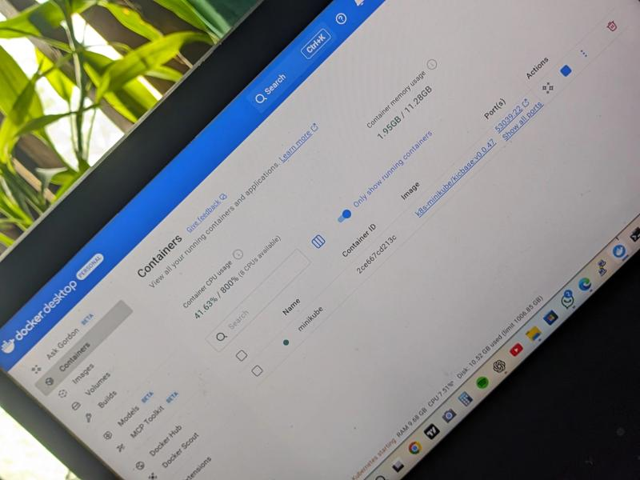
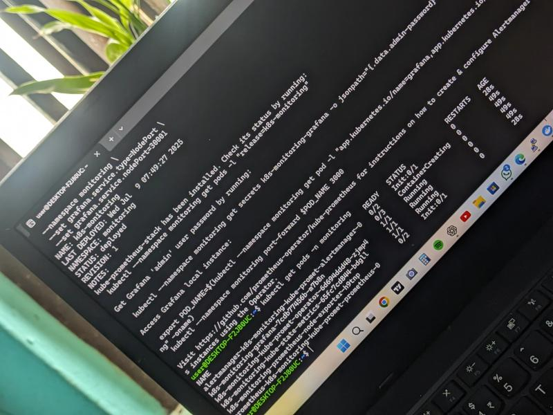
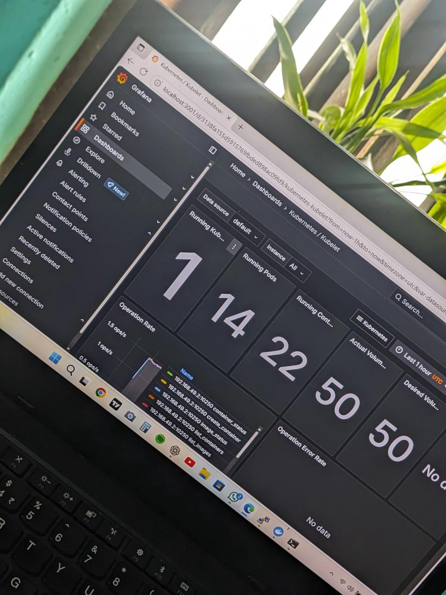

# Kubernetes Monitoring Stack with Flask, Prometheus & Grafana

This project simulates a full-stack DevOps deployment using:

- Dockerized Flask web app
- Kubernetes (Minikube)
- Monitoring with Prometheus and Grafana
- Reverse proxy with Nginx (optional)
- WSL2 Ubuntu environment

## 🧰 Tech Stack

- Python, Flask
- Docker, Minikube, kubectl
- Prometheus, Grafana
- WSL2 Ubuntu

## 📦 How to Run

1. Start Minikube  
2. Build Docker image  
3. Apply `k8s/` YAML files  
4. Install Prometheus + Grafana using Helm  
5. Access Grafana via `localhost:3001` after port-forwarding  

## 🔭 Features

- Real-time pod monitoring  
- Flask app exposed via NodePort and reverse proxy  
- Grafana dashboards for Kubernetes metrics  

## 📸 Screenshots

  
  
  

